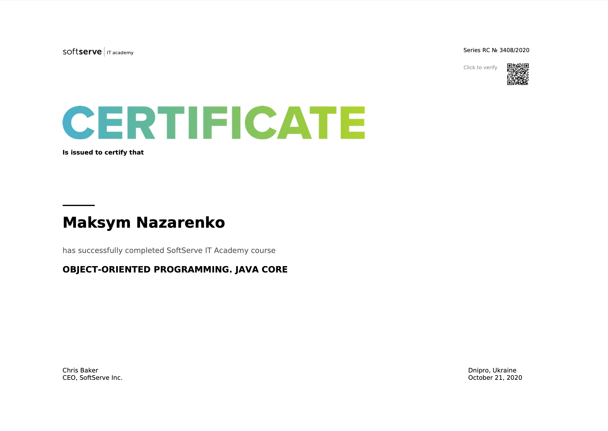

# SoftServe JavaCore
### SoftServe course: Object-oriented programming. Java Core

[Click to verify certificate](https://career.softserveinc.com/en-us/certification/verification)

* [Lesson 1](https://github.com/MaksNazarenko/soft-serve-java-core/tree/master/MyCourse/src/com/nazarenko/lesson/lesson_1) **Java Core Intro**:
    * [Task](https://github.com/MaksNazarenko/soft-serve-java-core/tree/master/MyCourse/src/com/nazarenko/lesson/lesson_1/task1)
    * [Home work](https://github.com/MaksNazarenko/soft-serve-java-core/tree/master/MyCourse/src/com/nazarenko/lesson/lesson_1/homework1)
* Lesson 2 **Java Core Git**:
    * [Resources to learn Git](https://try.github.io/)
    * [Learn Git Branching](https://learngitbranching.js.org/)
* [Lesson 3](https://github.com/MaksNazarenko/soft-serve-java-core/tree/master/MyCourse/src/com/nazarenko/lesson/lesson_3) **OOP Intro** :
    * [Task](https://github.com/MaksNazarenko/soft-serve-java-core/tree/master/MyCourse/src/com/nazarenko/lesson/lesson_3/task1)
    * [Home work](https://github.com/MaksNazarenko/soft-serve-java-core/tree/master/MyCourse/src/com/nazarenko/lesson/lesson_3/homework1)
* [Lesson 4](https://github.com/MaksNazarenko/soft-serve-java-core/tree/master/MyCourse/src/com/nazarenko/lesson/lesson_4) **Conditional Statements**:
    * [Task](https://github.com/MaksNazarenko/soft-serve-java-core/tree/master/MyCourse/src/com/nazarenko/lesson/lesson_4/task1)
    * [Home work](https://github.com/MaksNazarenko/soft-serve-java-core/tree/master/MyCourse/src/com/nazarenko/lesson/lesson_4/homework1)
* [Lesson 5](https://github.com/MaksNazarenko/soft-serve-java-core/tree/master/MyCourse/src/com/nazarenko/lesson/lesson_5) **Arrays. Loops**:
    * [Triangles](https://github.com/MaksNazarenko/soft-serve-java-core/tree/master/MyCourse/src/com/nazarenko/lesson/lesson_5/triangles)
    * [Sorting](https://github.com/MaksNazarenko/soft-serve-java-core/tree/master/MyCourse/src/com/nazarenko/lesson/lesson_5/sorting)
    * [Task](https://github.com/MaksNazarenko/soft-serve-java-core/tree/master/MyCourse/src/com/nazarenko/lesson/lesson_5/task_1)
    * [Home work](https://github.com/MaksNazarenko/soft-serve-java-core/tree/master/MyCourse/src/com/nazarenko/lesson/lesson_5/homework1)
* [Lesson 6] **OOP. Inheritance**
    *
* [Project] **University**
    * [Royal University of Nazarenko](https://github.com/MaksNazarenko/soft-serve-java-core/tree/master/MyCourse/src/com/nazarenko/project/university)
